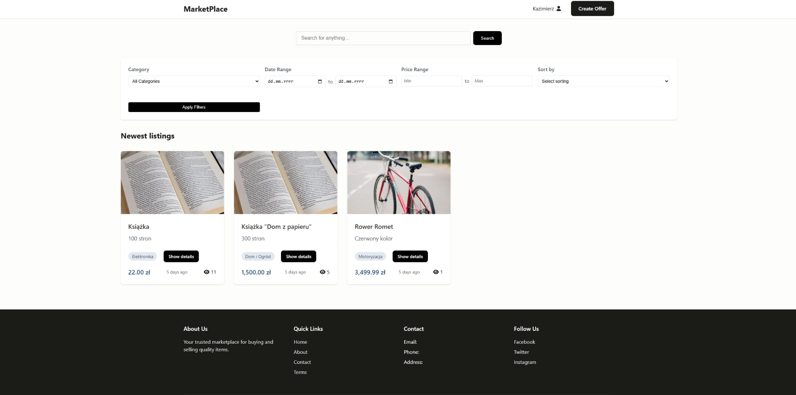
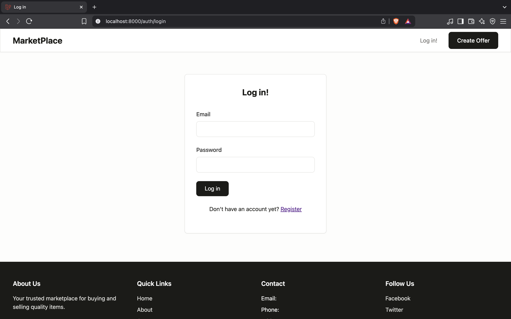
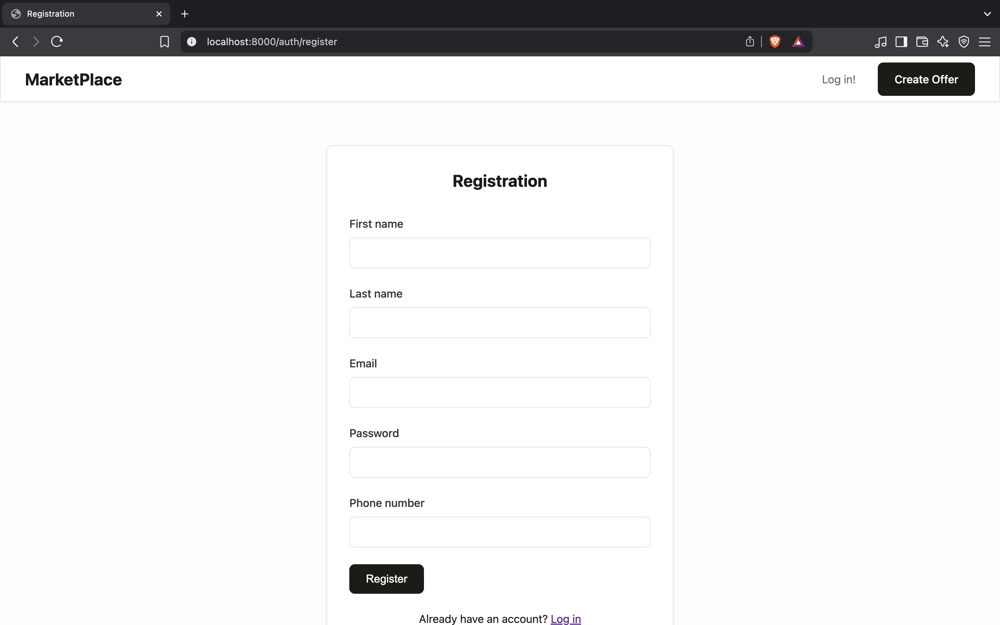
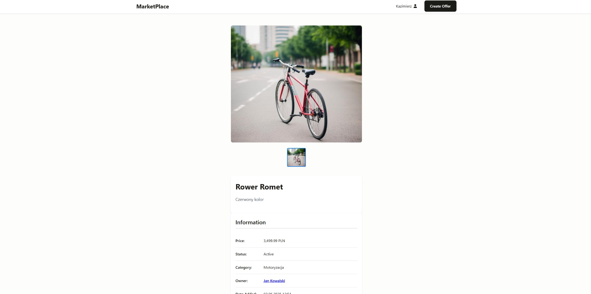
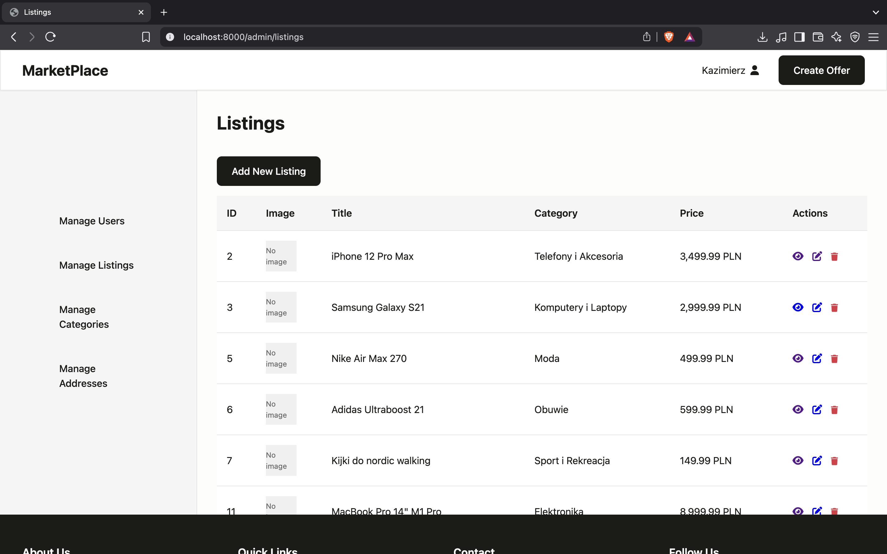
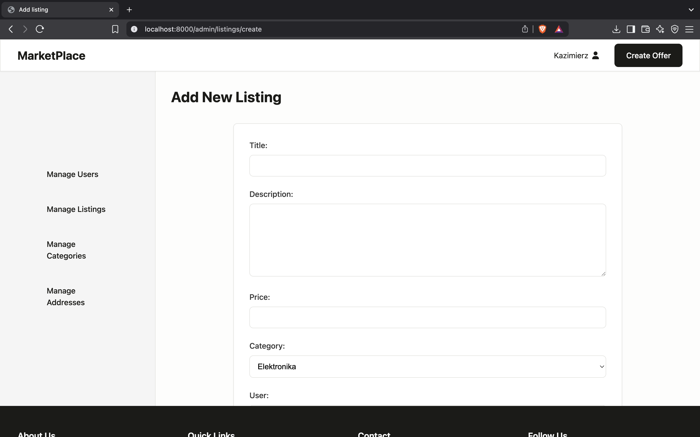
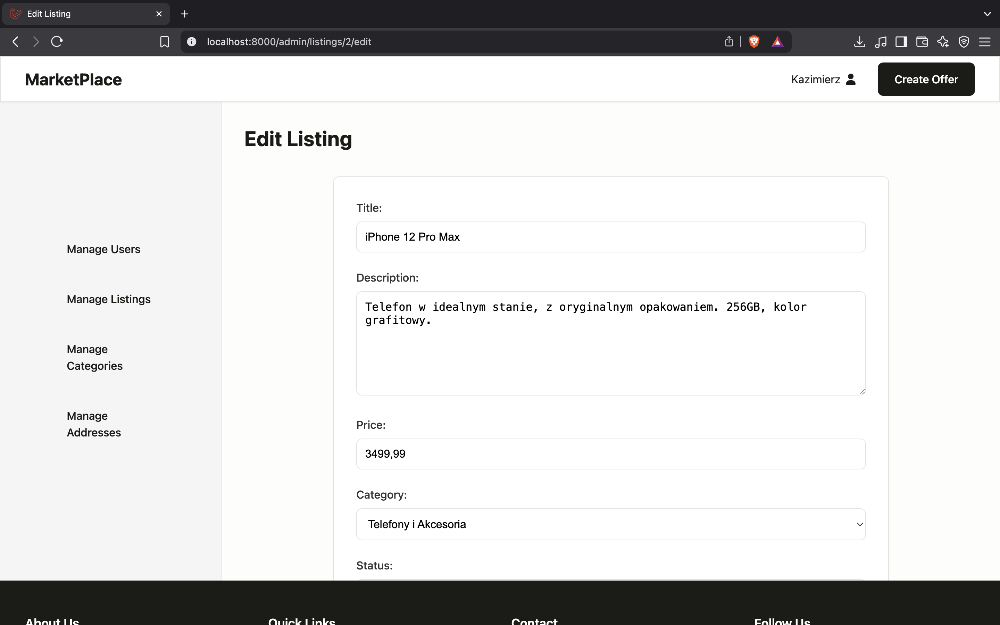
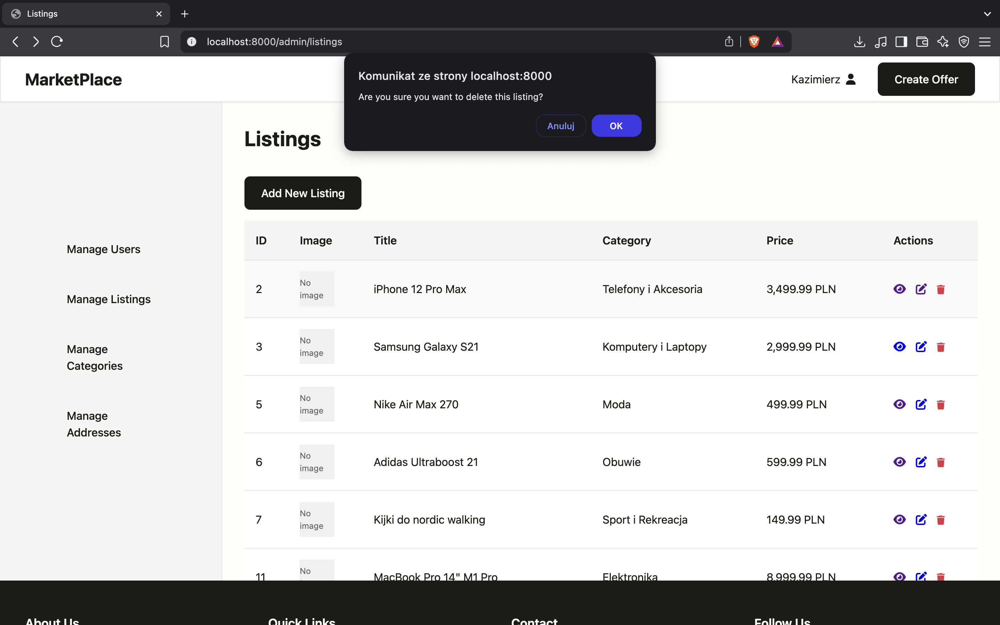

# Projekt AI1

[Repozytorium projektu](https://github.com/lab2-team1/ai1)

[Tablica projektowa](https://github.com/orgs/lab2-team1/projects/1)

---


### Tytuł projektu

Portal z ogłoszeniami kupna-sprzedaży
=======
### Temat projektu

Portal z ogłoszeniami kupna-sprzedaży 


---

### Zespół X

| Profil | Rola |
| ------ | ------ |
| [Dawid Bajek](https://github.com/Baju16) | lider zespołu |
| [Krzysztof Dąbrowski](https://github.com/SooNlK) | członek zespołu |
| [Oscar Borowiec](https://github.com/oscarek03) | członek zespołu |
| [Łukasz Babiś](https://github.com/Chirockat) | członek zespołu |


---


## Opis projektu


Aplikacja webowa oparta na frameworku Laravel, która umożliwia


Dostępne funkcjonalności:
* Uwierzytelnianie i autoryzacja użytkowników,
* Wystawianie produktów w serwisie aukcyjnym,

### Narzędzia i technologie
* PHP 8.2
* Laravel Framework 12.0
* Node.js (najnowsza wersja LTS)
* Vite 6.2.4
* Axios 1.8.2
* Composer (najnowsza wersja)
* PostgreSQL


### Uruchomienie aplikacji

Napisać, co trzeba mieć zainstalowane (oraz inne potrzebne dodatkowe informacje).

```
Kroki potrzebne do postawienia aplikacji:

1. Przeczytaj AI1 Instalacja potrzebnych komponentów.pdf autorstwa mgr inż. Jaromira Sarzyńskiego
i wykonaj wszystkie polecenia (włącznie z instalacją rozszerzeń)
2. Wejdź na https://www.enterprisedb.com/downloads/postgres-postgresql-downloads i pobierz 
najnowszą wersję na Windowsa. Zainstaluj z domyślnymi ustawieniami, jako hasło podaj 123
3. Wejdz na https://nodejs.org/en i zainstaluj Node.js LTS, z domyślnymi ustawieniami
4. Wejdź w zmienne środowiskowe w Windows, kliknij 2 razy Path z zmiennych 
użytkownika, kliknij nowy, wpisz adres 
C:\Program Files\PostgreSQL\16\bin
Zapisz zmiany
4. Uruchom skrypt start.bat znajdujący się w folderze głównym
5. Uruchom projekt w VSC
6. W jednej konsoli wpisz
npm run dev
7. W drugiej konsoli wpisz
php artisan serve
8. Otworz wyswietlajacy sie link


Komendy z start.bat:


@echo off
REM setup.bat - pełna inicjalizacja środowiska Laravel + PostgreSQL

REM 1. Ustawienie ExecutionPolicy dla PowerShell
powershell -Command "Set-ExecutionPolicy -Scope CurrentUser -ExecutionPolicy RemoteSigned -Force"

REM 2. Odkomentowanie rozszerzeń w php.ini
REM powershell -Command "(Get-Content 'C:\xampp\php\php.ini') -replace ';extension=pdo_pgsql', 'extension=pdo_pgsql' -replace ';extension=pgsql', 'extension=pgsql' | Set-Content 'C:\xampp\php\php.ini'"
REM echo Sprawdź, czy rozszerzenia pdo_pgsql i pgsql są odkomentowane w php.ini!


REM 3. Tworzenie bazy danych (jeśli nie istnieje)
echo Tworzenie bazy danych ShopDB...
set PGPASSWORD=123
psql -U postgres -h 127.0.0.1 -p 5432 -tc "SELECT 1 FROM pg_database WHERE datname = 'ShopDB'" | find "1" >nul
if errorlevel 1 (
    psql -U postgres -h 127.0.0.1 -p 5432 -c "CREATE DATABASE \"ShopDB\";"
) else (
    echo Baza ShopDB już istnieje.
)

REM 4. Kopiowanie .env.example do .env (jeśli nie istnieje)
if not exist .env (
    copy .env.example .env
)

REM 5. Ustawienie danych do bazy w .env (usuń # jeśli jest na początku linii)
powershell -Command "(Get-Content .env) -replace '^[#\s]*DB_CONNECTION=.*', 'DB_CONNECTION=pgsql' | Set-Content .env"
powershell -Command "(Get-Content .env) -replace '^[#\s]*DB_HOST=.*', 'DB_HOST=127.0.0.1' | Set-Content .env"
powershell -Command "(Get-Content .env) -replace '^[#\s]*DB_PORT=.*', 'DB_PORT=5432' | Set-Content .env"
powershell -Command "(Get-Content .env) -replace '^[#\s]*DB_DATABASE=.*', 'DB_DATABASE=ShopDB' | Set-Content .env"
powershell -Command "(Get-Content .env) -replace '^[#\s]*DB_USERNAME=.*', 'DB_USERNAME=postgres' | Set-Content .env"
powershell -Command "(Get-Content .env) -replace '^[#\s]*DB_PASSWORD=.*', 'DB_PASSWORD=123' | Set-Content .env"

REM 6. Instalacja zależności PHP
echo Instalacja zależności Composer...
call composer install

REM 7. Instalacja zależności JS
echo Instalacja zależności NPM...
call npm install

REM 8. Migracje i seed
echo Migracje i seed...
call php artisan migrate:fresh --seed

REM 9. Link do storage
call php artisan storage:link

echo Gotowe! Środowisko przygotowane.

pause

```


* administrator: swit@email.com 1234
* użytkownik: kowalski@email.com 1234
* użytkownik: nowak@email.com 1234
* użytkownik: wisniewski@email.com 1234


### Baza danych


## Widoki aplikacji 


*Strona główna*


*Logowanie*


*Rejestracja*


*Oferta*





*CRUD Listing*


*Oferta*


*CRUD Categories*

*Zarządzanie użytkownikami*

...

*Profil użytkownika*

...

*Dokonanie zakupu/wypożyczenia...*

...

itd.

...


...
